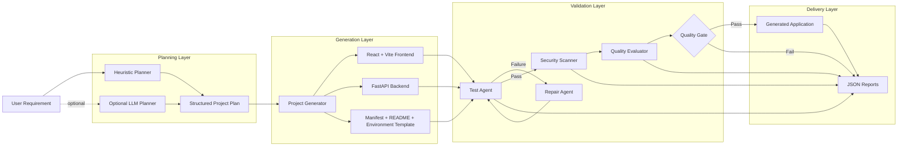
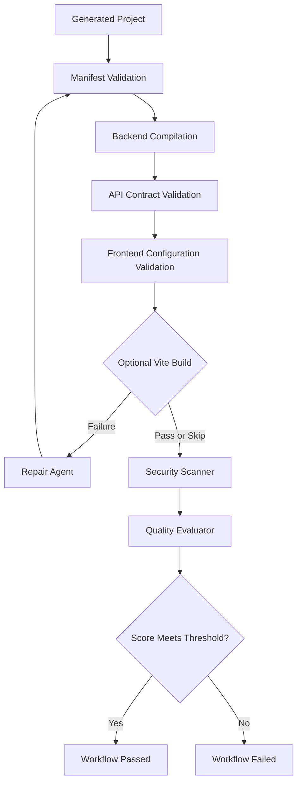

<div align="center">

# AgentForge Studio

### Evaluation-first, agentic full-stack application generation

AgentForge Studio converts natural-language product requirements into structured, tested, security-scanned, and quality-evaluated React and FastAPI application scaffolds.

[](https://github.com/venkatkoushik22/agentforge-studio/actions/workflows/ci.yml)


[Architecture](#architecture) •
[Quick Start](#quick-start) •
[CLI](#command-line-interface) •
[Quality Pipeline](#quality-and-safety-pipeline) •
[Roadmap](#roadmap)

</div>

---

## Overview

Most code-generation tools stop after writing files.

AgentForge Studio treats generation as only the first stage of a software-engineering pipeline. Every generated project can pass through:

1. Requirement analysis
2. Structured project planning
3. React and FastAPI scaffold generation
4. Automated validation
5. Deterministic repair and retesting
6. Static security scanning
7. Quality evaluation
8. Configurable pass/fail quality gating

The default workflow runs locally with a free heuristic planner. An OpenAI-powered structured planner is available as an optional extension.

---

## Why AgentForge Studio?

Generated code is difficult to trust when there is no visibility into:

- What architecture was selected
- Which files should exist
- Whether the backend compiles
- Whether the frontend calls the expected API
- Whether unsafe patterns were introduced
- Whether the output meets a defined quality threshold
- What happened when validation failed

AgentForge addresses this by making planning, generation, testing, repair, security, and evaluation explicit workflow stages with machine-readable reports.

---

## Architecture



### Workflow State

LangGraph coordinates the pipeline using shared workflow state containing:

- Original user requirement
- Selected planning strategy
- Structured project plan
- Generated project directory
- Test report
- Repair history
- Security report
- Evaluation report
- Quality threshold
- Final workflow status

Each workflow node returns a partial state update, allowing the pipeline to route, retry, or fail without tightly coupling individual components.

---

## Core Capabilities

### Structured Requirement Planning

The planner converts natural-language requirements into a normalized project specification containing:

- Project name
- Application category
- Frontend framework
- Backend framework
- Database choice
- Feature list
- Folder structure
- Security warnings

The default heuristic planner recognizes common application requirements such as:

- Authentication
- Administrative access
- Payments
- Search and filtering
- File uploads
- Notifications
- Analytics
- Real-time communication
- REST APIs

### Optional LLM Planning

An optional OpenAI-powered planner uses structured output validation to produce richer project specifications.

The LLM planner is isolated from the core workflow:

- It is not required for local generation
- It uses a separate dependency file
- It is selected explicitly through the CLI
- API failures do not prevent use of the heuristic planner
- API keys remain outside source control

### Full-Stack Scaffold Generation

AgentForge currently generates:

- React frontend
- Vite configuration
- FastAPI backend
- CORS middleware
- Health endpoint
- Project metadata endpoint
- Frontend-to-backend API integration
- Environment template
- Project manifest
- Project-specific README
- Git ignore rules

### Automated Test Agent

The generated-project test agent validates:

- Manifest integrity
- Required file existence
- Backend Python compilation
- FastAPI route definitions
- CORS configuration
- Frontend package configuration
- React entry points
- Frontend API integration
- Optional Vite production build

### Deterministic Repair Agent

When validation fails, the repair loop can:

1. Read failed test checks
2. Rebuild the scaffold from the original structured plan
3. Replace damaged generated files
4. Retest the application
5. Continue or fail after the configured repair limit

Repair history is preserved in workflow state for debugging and future auditability.

### Security Scanner

The scanner performs static detection for common high-risk patterns:

- Hard-coded passwords
- Hard-coded API keys
- Authentication tokens and secrets
- AWS access keys
- Private key material
- Python `eval` and `exec`
- Operating-system command execution
- Subprocess calls with `shell=True`
- JavaScript dynamic evaluation
- Node.js command execution
- Wildcard CORS configuration

### Quality Evaluator

Generated projects receive an evaluation score based on:

- Required file completeness
- Backend syntax validity
- Frontend configuration
- Frontend-backend API contract
- Security report status

The workflow can reject an application when its score is below a configurable threshold.

---

## Quality and Safety Pipeline



### Generated Reports

Every workflow stage produces machine-readable JSON artifacts:

| Artifact | Purpose |
|---|---|
| `project_plan.json` | Normalized interpretation of the requirement |
| `manifest.json` | Inventory of generated files |
| `test_report.json` | Automated validation results |
| `security_report.json` | Findings grouped by severity |
| `evaluation_report.json` | Quality score and individual checks |

These reports are designed for debugging, auditing, CI integration, and future dashboard visualization.

---

## Technology Stack

| Layer | Technologies |
|---|---|
| Core language | Python |
| Workflow orchestration | LangGraph |
| Generated backend | FastAPI |
| Generated frontend | React, Vite |
| Database configuration | PostgreSQL, SQLite |
| Testing | `unittest`, custom generated-project test agent |
| Security | Custom static scanner |
| Evaluation | Rule-based quality evaluator |
| CI/CD | GitHub Actions |
| Optional AI planning | OpenAI API, Pydantic structured output |

---

## Quick Start

### 1. Clone the repository

```bash
git clone https://github.com/venkatkoushik22/agentforge-studio.git
cd agentforge-studio
```

### 2. Create a virtual environment

#### Windows PowerShell

```powershell
py -m venv .venv
.\.venv\Scripts\Activate.ps1
```

#### macOS or Linux

```bash
python3 -m venv .venv
source .venv/bin/activate
```

### 3. Install core dependencies

```bash
python -m pip install --upgrade pip
python -m pip install -r requirements.txt
```

### 4. Generate an application

```powershell
py -m src.main "Build DevTrack, a React issue tracking dashboard using FastAPI and PostgreSQL with login, admin roles, search, analytics, and notifications" --generate --planner heuristic --skip-frontend-build --minimum-score 90
```

The generated project will be written to:

```text
generated_projects/
```

---

## Example Workflow Output

```text
Project generated at:
generated_projects/devtrack-react-issue-tracking

Planner used: heuristic

Automated tests
---------------
Status: passed
Passed: 4
Failed: 0
Skipped: 1

Repair agent
------------
Attempts used: 0
No repairs were needed.

Security scan
-------------
Status: passed
Total findings: 0
Critical: 0
High: 0
Medium: 0
Low: 0

Quality evaluation
------------------
Status: passed
Score: 100.0%
Checks passed: 5/5

LangGraph workflow
------------------
Final status: passed
```

---

## Command-Line Interface

Display all available options:

```powershell
py -m src.main --help
```

### Main Options

| Option | Description |
|---|---|
| `--generate` | Run the complete AgentForge workflow |
| `--save` | Save only the structured project plan |
| `--force` | Replace an existing generated project |
| `--planner heuristic` | Use the free local planner |
| `--planner llm` | Use the optional API-powered planner |
| `--llm-model` | Override the configured LLM model |
| `--skip-frontend-build` | Skip the Vite production build |
| `--max-repair-attempts` | Set repair attempts from 0 to 3 |
| `--skip-security-scan` | Skip static security analysis |
| `--skip-evaluation` | Skip project quality evaluation |
| `--minimum-score` | Define the minimum passing score |

### Generate with the free planner

```powershell
py -m src.main "Build an inventory management dashboard using React, FastAPI, PostgreSQL, login, search, analytics, and admin roles" --generate --planner heuristic --skip-frontend-build
```

### Use a stricter quality gate

```powershell
py -m src.main "Build a project management platform using React and FastAPI" --generate --minimum-score 95 --max-repair-attempts 2 --skip-frontend-build
```

### Save only the project plan

```powershell
py -m src.main "Build an appointment booking application with authentication and notifications" --save
```

---

## Running a Generated Application

Assume AgentForge generated:

```text
generated_projects/example-project/
```

### Backend

```powershell
cd generated_projects\example-project\backend

py -m venv .venv

.\.venv\Scripts\python.exe -m pip install -r requirements.txt

.\.venv\Scripts\python.exe -m uvicorn app.main:app --reload
```

Available endpoints:

```text
http://127.0.0.1:8000
http://127.0.0.1:8000/health
http://127.0.0.1:8000/api/project
http://127.0.0.1:8000/docs
```

### Frontend

Open another terminal:

```powershell
cd generated_projects\example-project\frontend

npm install

npm run dev
```

Open the local Vite URL, normally:

```text
http://localhost:5173
```

The frontend retrieves live metadata from the generated FastAPI API.

---

## Optional LLM Planner

The complete core workflow works without API access.

To enable optional LLM planning:

### Install optional dependencies

```bash
python -m pip install -r requirements-llm.txt
```

### Create the local environment file

#### Windows

```powershell
Copy-Item .env.example .env
```

#### macOS or Linux

```bash
cp .env.example .env
```

Configure your private environment:

```env
OPENAI_API_KEY=your_private_api_key
OPENAI_MODEL=your_supported_model
```

Run:

```powershell
py -m src.main "Build a patient appointment platform with provider scheduling and role-based access" --generate --planner llm
```

The `.env` file is ignored by Git and must never be committed.

---

## Testing

### Run all repository tests

```powershell
py -m unittest discover -s tests -p "test_*.py" -v
```

### Compile the complete Python codebase

```powershell
py -m compileall -q src tests
```

### Test an existing generated project

Without running the frontend build:

```powershell
py -m src.agents.tester generated_projects\example-project --skip-frontend-build
```

With the Vite production build:

```powershell
py -m src.agents.tester generated_projects\example-project
```

---

## Security Scanning

Run the scanner independently:

```powershell
py -m src.security.scanner generated_projects\example-project
```

Example result:

```json
{
  "status": "passed",
  "total_findings": 0,
  "severity_counts": {
    "CRITICAL": 0,
    "HIGH": 0,
    "MEDIUM": 0,
    "LOW": 0
  },
  "findings": []
}
```

---

## Quality Evaluation

Evaluate a generated project:

```powershell
py -m src.evaluation.evaluator generated_projects\example-project
```

Example result:

```json
{
  "status": "passed",
  "overall_score": 100.0,
  "passed_checks": 5,
  "total_checks": 5
}
```

---

## Generated Application Structure

```text
generated-project/
├── backend/
│   ├── app/
│   │   ├── __init__.py
│   │   └── main.py
│   ├── .env.example
│   └── requirements.txt
├── frontend/
│   ├── src/
│   │   ├── App.jsx
│   │   └── main.jsx
│   ├── index.html
│   └── package.json
├── .gitignore
├── README.md
├── manifest.json
├── project_plan.json
├── test_report.json
├── security_report.json
└── evaluation_report.json
```

---

## Repository Structure

```text
agentforge-studio/
├── .github/
│   └── workflows/
│       └── ci.yml
├── src/
│   ├── agents/
│   │   ├── generator.py
│   │   ├── planner.py
│   │   ├── llm_planner.py
│   │   ├── tester.py
│   │   └── repairer.py
│   ├── core/
│   │   └── workflow.py
│   ├── evaluation/
│   │   └── evaluator.py
│   ├── models/
│   │   └── schemas.py
│   ├── security/
│   │   └── scanner.py
│   └── main.py
├── tests/
├── generated_projects/
├── .env.example
├── requirements.txt
├── requirements-llm.txt
├── LICENSE
└── README.md
```

---

## Engineering Decisions

### Evaluation Before Trust

Generation success does not imply application correctness. AgentForge validates outputs before marking a workflow as successful.

### Structured Plans as the Source of Truth

The project plan is reused by generation and repair stages, improving reproducibility and reducing hidden state.

### Deterministic Core Workflow

The default system works locally without an LLM, allowing tests and CI runs to remain reproducible.

### Optional External Intelligence

LLM planning is an enhancement rather than a hard dependency.

### Explicit Failure States

Tests, security findings, evaluation scores, and repair attempts are preserved instead of being hidden behind a single success message.

### Machine-Readable Observability

Every major workflow stage emits JSON output that can be consumed by CI systems, dashboards, or future analytics pipelines.

---

## Current Scope and Limitations

AgentForge Studio is an engineering MVP, not a production application factory.

Current limitations include:

- Generated applications currently target React and FastAPI
- Database selection primarily produces configuration metadata
- Authentication and payment functionality are planned but not fully implemented templates
- The repair agent regenerates deterministic scaffold files instead of applying targeted patches
- The scanner is not a substitute for a complete security assessment
- Generated applications require domain-specific business logic before production use
- LLM planning requires separate API access and billing
- Deployment infrastructure is not yet generated

These limitations are documented to keep the project technically accurate and defensible.

---

## Roadmap

### Generation

- SQLAlchemy model generation
- Alembic migrations
- Authentication templates
- Role-based access control
- CRUD endpoint generation
- Multiple frontend templates
- Multiple backend templates

### Validation

- Generated backend unit tests
- Generated frontend component tests
- Dependency vulnerability scanning
- API schema validation
- Runtime health checks

### Repair

- Targeted file-level patching
- Failure-classification engine
- Optional LLM-assisted repair
- Repair-diff reporting

### Developer Experience

- Web-based workflow dashboard
- Generation history
- Downloadable project archives
- Docker and Docker Compose generation
- Deployment templates
- Execution latency metrics
- Token and cost tracking for optional LLM stages

---

## CI/CD

GitHub Actions automatically runs:

- Source compilation
- Unit tests
- Multi-version Python validation
- Generated-project smoke tests
- Frontend dependency installation
- Vite production build
- Security scanning
- Quality evaluation
- Report artifact uploads

The CI workflow uses the heuristic planner and does not require an OpenAI API key.

---

## Author

### Venkat Koushik Pillala

AI/ML Engineer focused on:

- LLM evaluation
- Agentic AI workflows
- Secure AI application development
- Retrieval-augmented generation
- Automated quality validation
- Production-oriented AI engineering

[GitHub](https://github.com/venkatkoushik22) •
[LinkedIn](https://www.linkedin.com/in/pillala-venkat-koushik/) •
[Portfolio](https://personal-engineering-portfolio-hub.vercel.app/)

---

## License

This project is licensed under the MIT License.

See the [`LICENSE`](LICENSE) file for full terms.

---

## Disclaimer

AgentForge Studio generates development scaffolds for experimentation, prototyping, and evaluation.

Generated applications must be reviewed, tested, secured, and adapted before production use, especially when handling authentication, payments, healthcare information, financial information, personal data, or other sensitive workloads.